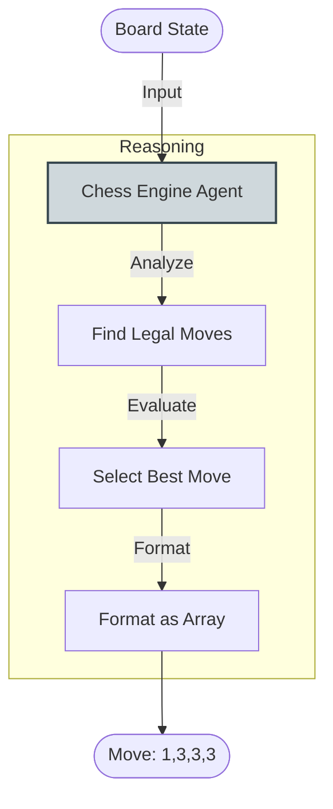

# Chess Agent (ADK) - Documentation

## 📄 File: `chess_agent_adk.py`

### 🔍 Overview
This script implements a **Chess Engine Agent** using the Google ADK. It defines a specialized agent that takes a textual board representation and outputs the best move for BLACK in a specific index-based format `[fromRow, fromCol, toRow, toCol]`.

### 🌊 Workflow Diagram



### ⚙️ Key Logic
1.  **Instruction Optimization**: The prompt is heavily engineered to force a structured output: "Output ONLY the 4 numbers... No explanation."
2.  **Output Parsing**: The code includes a regex block (`re.findall`) to robustness extract the move coordinates even if the model chatters slightly.

### 🚀 Usage
```bash
venv/bin/python "Other/chess_agent_adk.py"
```
