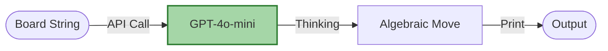

# Chess Agent (OpenAI) - Documentation

## 📄 File: `chess_agent_openai.py`

### 🔍 Overview
This is an alternative implementation of the **Chess Agent** using the OpenAI API (GPT-4o-mini). It performs the same task—analyzing a board string and suggesting a move—but uses standard algebraic notation (e.g., "Nf6") instead of array indices.

### 🌊 Workflow Diagram



### ⚙️ Key Logic
1.  **Prompting**: Asks for "standard algebraic notation" and forbids extra text.
2.  **Simplicity**: Uses the `langchain_openai` library for a direct, minimal interface.

### 🚀 Usage
```bash
venv/bin/python "Other/chess_agent_openai.py"
```
