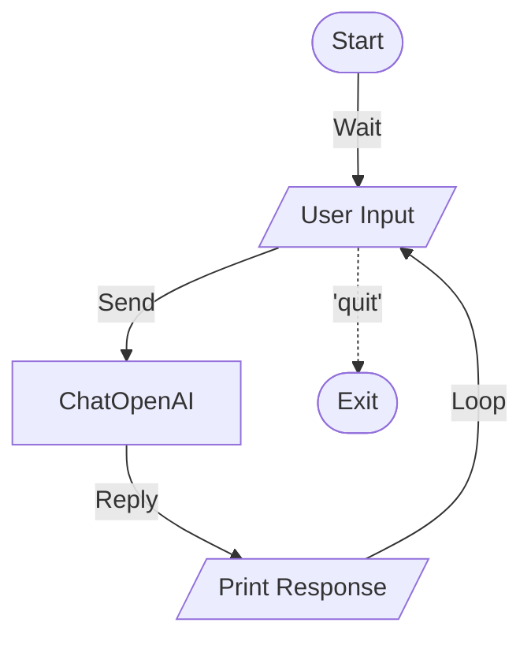

# Real Chat - Documentation

## 📄 File: `real_chat.py`

### 🔍 Overview
This script is a simple **Interactive Chat** loop. It serves as a baseline or "Hello World" for connecting to an LLM (OpenAI in this case). It maintains a loop where you can type messages and get responses until you type "quit".

### 🌊 Workflow Diagram



### ⚙️ Key Logic
1.  **Infinite Loop**: `while True` cycle for continuous conversation.
2.  **Error Handling**: Basic try/except blocks to catch API errors or interruptions.

### 🚀 Usage
```bash
venv/bin/python "Other/real_chat.py"
```
