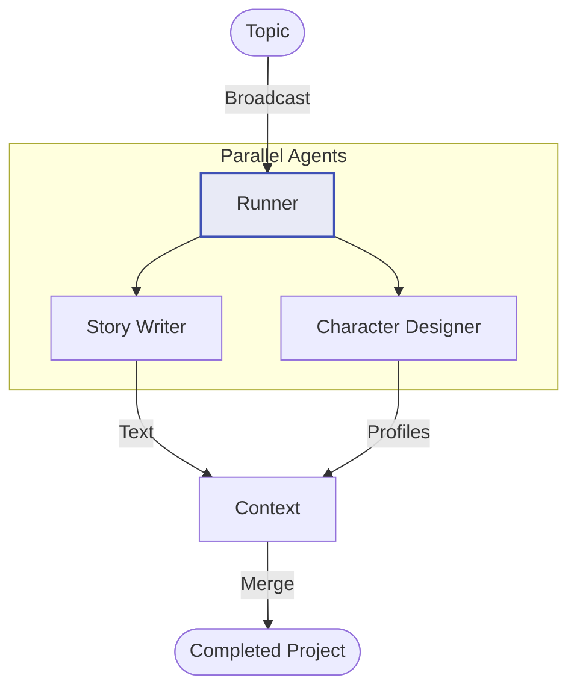

# Parallelization ADK - Documentation

## 📄 File: `parallelization_adk.py`

### 🔍 Overview
This script demonstrates the **Parallel Agent Pattern** using the Google ADK. It sets up multiple specialized agents (e.g., Story Writer, Reviewer, Illustrator) that can technically receive the same context and work simultaneously, with a final step to aggregate their outputs.

### 🌊 Workflow Diagram



### ⚙️ Key Logic
1.  **ParallelAgent**: The ADK provides a `ParallelAgent` class (or similar construct) to manage concurrent execution.
2.  **Shared Context**: All agents contribute to a shared `InvocationContext` or session history.

### 🚀 Usage
```bash
venv/bin/python "Parallelization/parallelization_adk.py"
```
