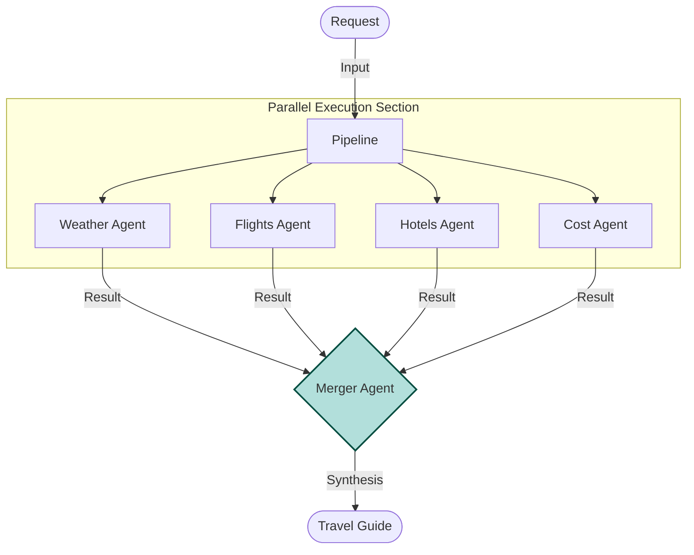

# Parallel Trip Planner (ADK) - Documentation

## 📄 File: `trip_parallel_adk.py`

### 🔍 Overview
This script implements a **Parallelization (Sectioning)** pattern. A complex "Plan Trip" request is broken down into four distinct domains (Weather, Flights, Hotels, Cost). Specialized agents generate these sections independently, and a final "Merger" agent synthesizes them into a single report.

### 🌊 Workflow Diagram



### ⚙️ Key Logic
1.  **Isolation**: Each sub-agent is instructed to output *only* its specific domain data.
2.  **Merge Prompt**: The `merger_agent` uses a template prompt (e.g., `{{weather_result}}`) to verify that it has received all necessary inputs before generating the final text.
3.  **Sequential vs Parallel**: While currently implemented with `SequentialAgent` for simplicity, the architecture allows these sub-agents to run asynchronously.

### 🚀 Usage
```bash
venv/bin/python "Parallelization/trip_parallel_adk.py"
```
