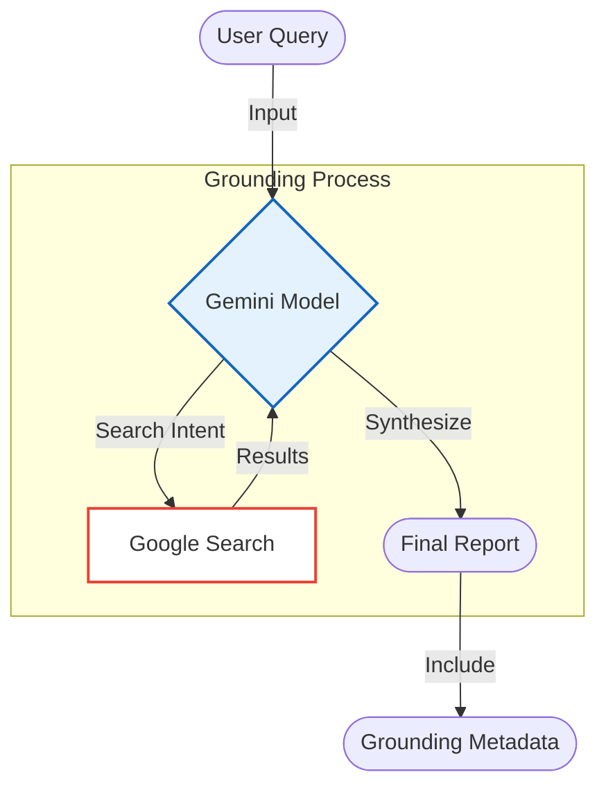

# Gemini Deep Research (Grounded) - Documentation

## 📄 File: `gemini_deep_research.py`

### 🔍 Overview
This script is the **Google Gemini equivalent** of the OpenAI Deep Research workflow. It leverages **Gemini 2.0 Flash / 1.5 Pro** with **Google Search Grounding**. This allows the model to perform real-time web searches to generate a data-driven report with source citations, similar to the `o3-deep-research` capability.

### 🌊 Workflow Diagram



### ⚙️ Key Logic
1.  **Configuration**: Uses `google.generativeai` configured with `GOOGLE_API_KEY`.
2.  **Tooling**: Activates `tools='google_search_retrieval'` (or equivalent grounding config) to permit the model to fetch live data.
3.  **Output Parsing**:
    *   **Text**: The standard `response.text`.
    *   **Grounding Metadata**: Iterates through `candidate.grounding_metadata` to extract titles and URLs of the sources used.

### 🚀 Usage
```bash
venv/bin/python "Planning/Deep Research/gemini_deep_research.py"
```

> **Note**: Search Grounding (Tools) availability depends on the specific model version and region.
