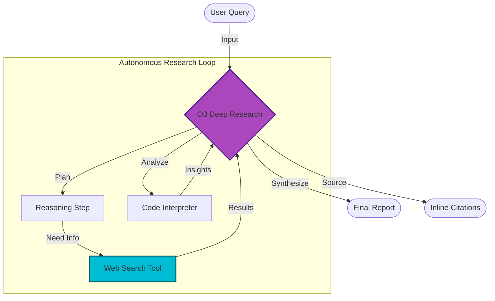

# OpenAI Deep Research (O3 Preview) - Documentation

## 📄 File: `openai_deep_research.py`

### 🔍 Overview
This script demonstrates how to interact with the **O3 Deep Research** model (preview) using the OpenAI API. Unlike standard chat completion, this model is designed to perform autonomous multi-step research, utilizing tools like **Web Search** and **Reasoning** to produce a data-driven report with citations.

### 🌊 Workflow Diagram



### ⚙️ Key Logic
1.  **Client Initialization**: Initializes `OpenAI` client securely using `.env`.
2.  **API Call (`client.responses.create`)**:
    *   **Model**: `o3-deep-research-2025-06-26` (Preview model).
    *   **Tools**: Explicitly enables `web_search_preview`.
    *   **Reasoning**: Enables auto-summarization of the thought process.
3.  **Output Parsing**:
    *   **Content**: The actual text report.
    *   **Annotations**: Structured metadata for citations (URL, Title, Start/End indices).
    *   **Steps**: Iterates through `response.output` to find `reasoning`, `web_search_call`, and `code_interpreter_call` events for transparency.

### 🚀 Usage
```bash
# Ensure you have the correct preview SDK and access
venv/bin/python "Planning/Deep Research/openai_deep_research.py"
```

> **Note**: This script targets a specific preview API structure. Ensure your `openai` python package matches the version required for O3 Deep Research access.
