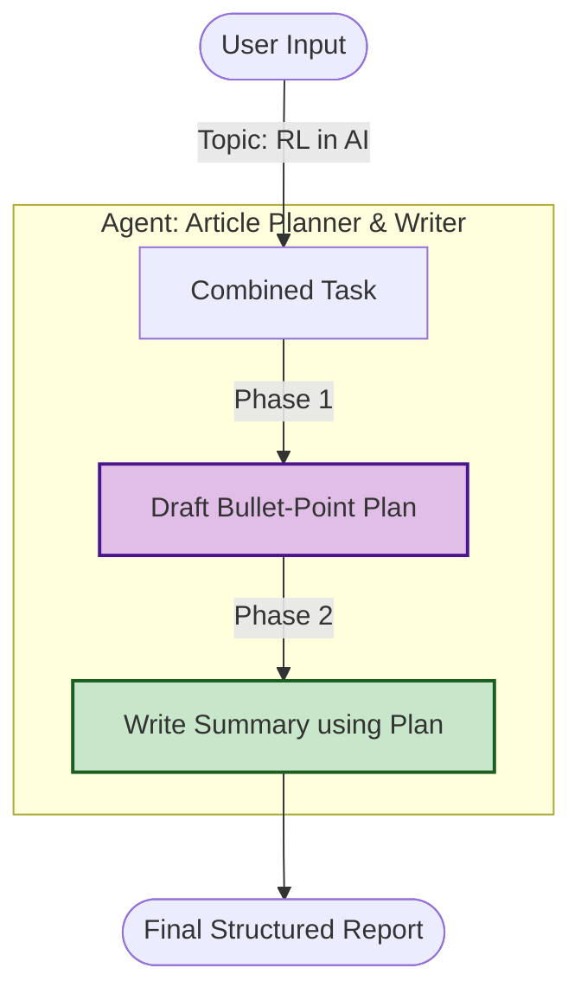

# Planning with CrewAI - Documentation

## 📄 File: `Planning-crewai.py`

### 🔍 Overview
This script demonstrates the **Plan-and-Execute** pattern using the CrewAI framework. It forces a single agent to first generate a structured plan (bullet points) and then write content based strictly on that plan. This two-step cognitive process improves the coherence and structure of long-form text generation.

### 🌊 Workflow Diagram



### ⚙️ Key Logic
1.  **Agent Definition**: A single agent (`planner_writer_agent`) is defined with a "Planner and Writer" persona.
2.  **Task Structure**: The `expected_output` is key here. It explicitly asks for two sections (`### Plan` and `### Summary`), forcing the model to output the plan before the content in a single generation pass.
3.  **Model**: Uses `gemini-2.5-flash` for fast reasoning.

### 🚀 Usage
```bash
venv/bin/python Planning/Planning-crewai.py
```
