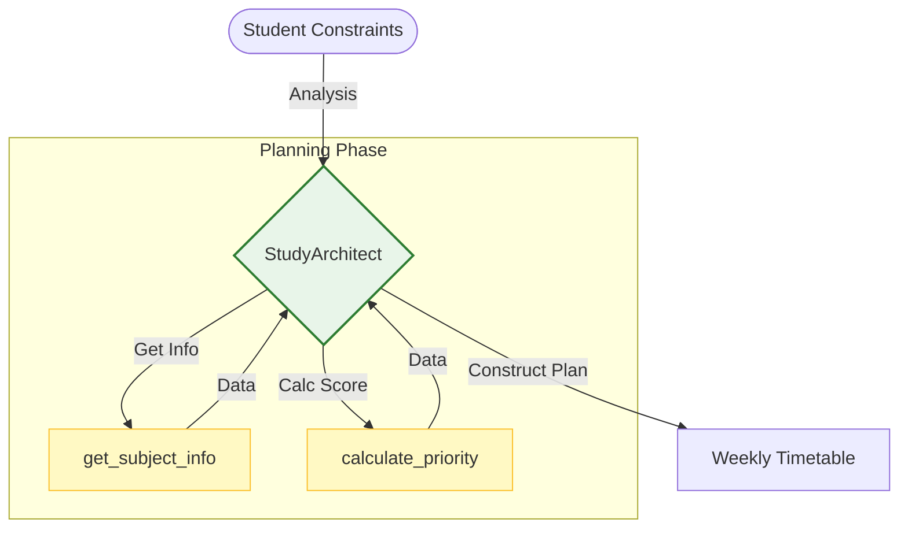

# Study Planner Agent (Planning Pattern)

## 📄 File: `Planning/StudyPlanner/study_planner_adk.py`

### 🔍 Overview
This project demonstrates the **Planning Pattern** applied to a constraint-satisfaction problem: Scheduling.
Unlike a simple chatbot that just says "Study hard," this agent:
1.  **Gathers Metadata**: Looks up subject difficulty.
2.  **Calculates Priority**: Uses a tool to score subjects based on "Time Until Exam" vs. "Difficulty".
3.  **Allocates Resources**: Maps high-priority tasks to the user's "Preferred Time" slots.

### 🌊 Workflow Diagram



### ⚙️ usage
To run the planner:

```bash
venv/bin/python "Planning/StudyPlanner/study_planner_adk.py"
```

### 🧠 Logic Explanation
*   **Dynamic HOW**: The agent doesn't have a template schedule. It builds it row-by-row based on the priority scores returned by the tools.
*   **Adaptability**: If the `calculate_priority` tool returns a score of "10" for Math (due to the exam being close), the Agent naturally floods the schedule with Math blocks, adhering to the "Planning requirements" to prioritize correctly.
