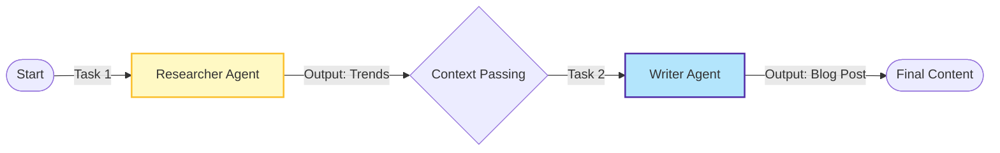

# Sequential Chain with CrewAI - Documentation

## 📄 File: `crew_ai_chain.py`

### 🔍 Overview
This script implements a classic **Prompt Chain** using CrewAI. It splits the workflow into two distinct roles: a **Researcher** who finds facts, and a **Writer** who creates content. The output of the Researcher is automatically passed as context to the Writer.

### 🌊 Workflow Diagram



### ⚙️ Key Logic
1.  **Agents**:
    *   `Senior Research Analyst`: Tasked with finding top AI trends.
    *   `Technical Content Writer`: Tasked with writing a blog post.
2.  **Context Passing**: The `writing_task` has a parameter `context=[research_task]`. This explicitly tells CrewAI to feed the researcher's findings into the writer's prompt.
3.  **Process**: `Process.sequential` ensures strict ordering (A then B).

### 🚀 Usage
```bash
venv/bin/python "Prompt Chaining/crew_ai_chain.py"
```
