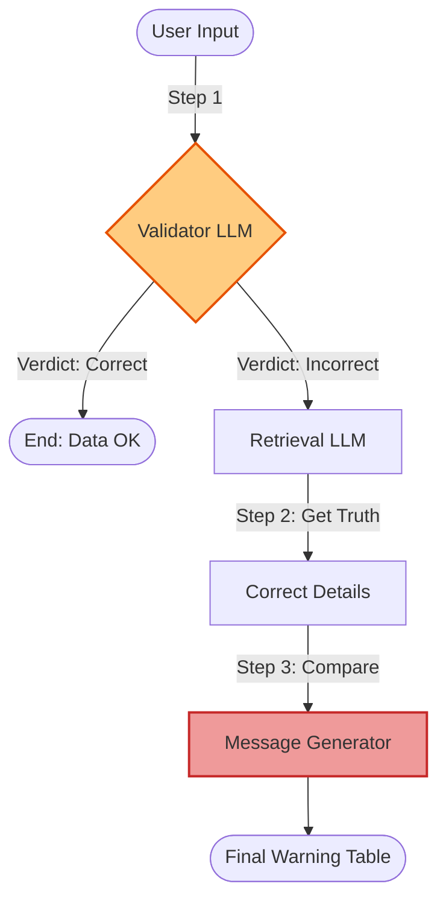

# Validation Chain (Gemini) - Documentation

## 📄 File: `gemini_validation_chain.py`

### 🔍 Overview
This script implements a **Validation Chain** using raw Gemini API calls. It validates user data against a "Check" prompt, and if the data is incorrect, it triggers a "Correction" chain to find the right data and present a comparison.

### 🌊 Workflow Diagram



### ⚙️ Key Logic
1.  **Rate Limiting**: Includes a `safe_generate` function to handle API quotas.
2.  **Conditional Logic**: The Python code acts as the controller. It checks `if validation_result == "No"` before deciding to run the extraction and message generation steps.
3.  **Functions**:
    *   `check_product`: Returns Yes/No.
    *   `get_product_details`: Extracts correct info.
    *   `message_passing`: Formats the user vs. correct data warning.

### 🚀 Usage
```bash
venv/bin/python "Prompt Chaining/gemini_validation_chain.py"
```
