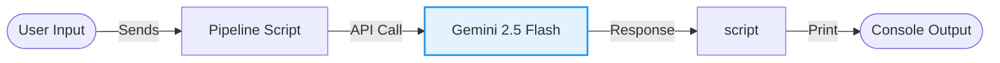

# Pipeline Basic (Practice) - Documentation

## 📄 File: `pipeline.py`

### 🔍 Overview
This is a basic practice script that sets up a simple processing pipeline using the Gemini API. It takes user input, sends it to the model, and prints the result. It serves as a foundational building block for more complex chaining.

### 🌊 Workflow Diagram



### ⚙️ Key Logic
1.  **Configuration**: setups `genai.configure` with the API key.
2.  **Generation**: Uses `model.generate_content(input)`.
3.  **Loop**: Typically runs in a `while` loop for continuous interaction.

### 🚀 Usage
```bash
venv/bin/python "Prompt Chaining/pipeline.py"
```
