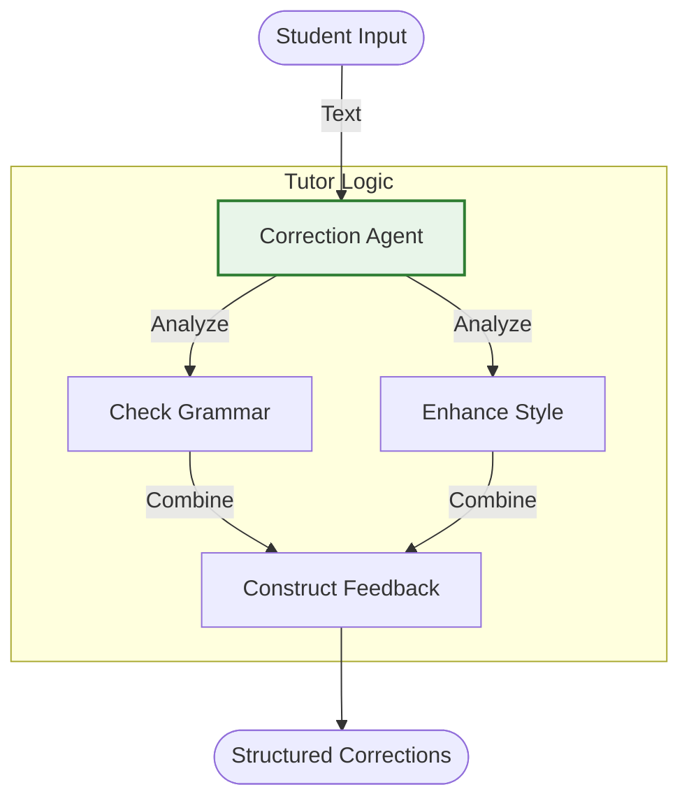

# English Teacher Pipeline - Documentation

## 📄 File: `pipeline_english.py`

### 🔍 Overview
This script is a specialized **Chain** designed to act as an English language tutor. It takes user input (sentences, paragraphs) and passes them through a specific prompt designed to correct grammar, improve vocabulary, and explain the changes.

### 🌊 Workflow Diagram



### ⚙️ Key Logic
1.  **Persona**: The system prompt sets the context ("You are an expert English teacher...").
2.  **Output Format**: The model is instructed to provide the "Corrected Version" followed by "Explanation of Changes".

### 🚀 Usage
```bash
venv/bin/python "Prompt Chaining/pipeline_english.py"
```
