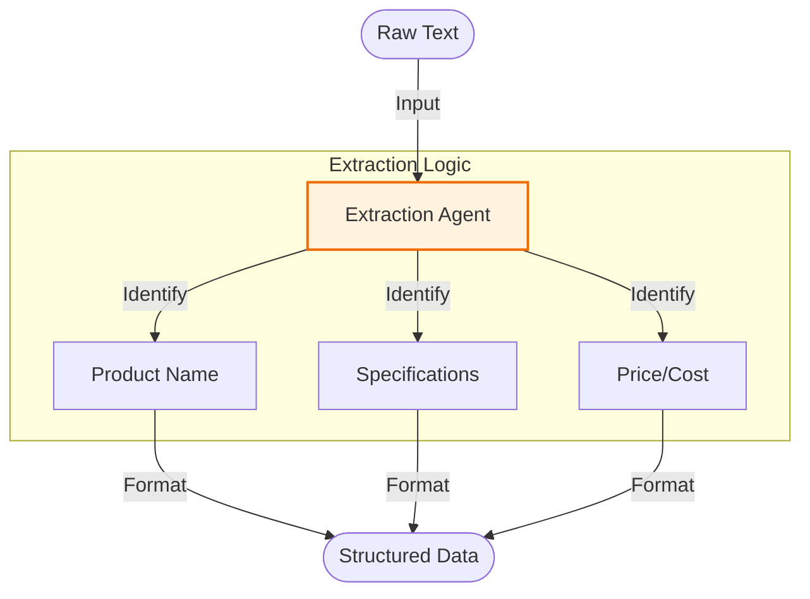

# Product Extractor Pipeline - Documentation

## 📄 File: `pipeline_product.py`

### 🔍 Overview
This script implements an **Extraction Chain**. Its purpose is to take unstructured text (e.g., product descriptions, emails) and extract structured product data (Name, Price, SKU, Features) into a clean format (JSON or list).

### 🌊 Workflow Diagram



### ⚙️ Key Logic
1.  **Prompt Engineering**: The prompt is tuned to "Extract" rather than "Generate".
2.  **Formatting**: Often instructs the model to return JSON or Key-Value pairs for easy programmatic parsing.

### 🚀 Usage
```bash
venv/bin/python "Prompt Chaining/pipeline_product.py"
```
