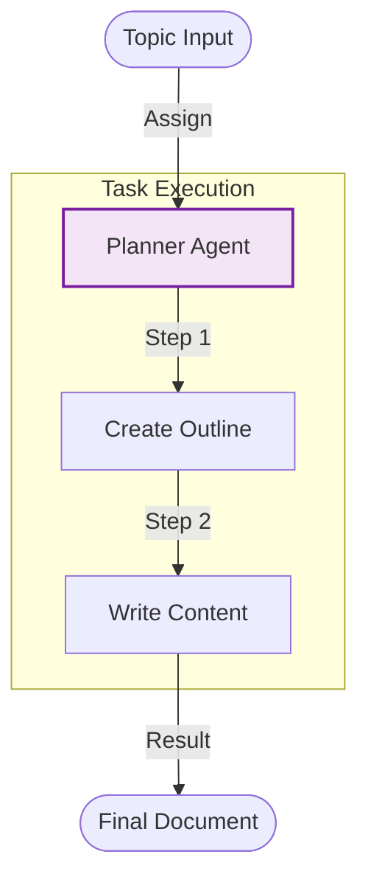

# Planning Crew (Sequential) - Documentation

## 📄 File: `planning_crew.py`

### 🔍 Overview
This script is a variation of the **Planning Pattern** using CrewAI. Unlike the single-agent planner, this script sets up a "Planner/Writer" agent with a specific task to create a plan *and* a summary in one go, emphasizing the sequential nature of the output.

### 🌊 Workflow Diagram



### ⚙️ Key Logic
1.  **Agent Config**: `allow_delegation=False` keeps the focus on the single agent's internal process.
2.  **Task Definition**: The `description` explicitly numbers the steps "1. Create a plan... 2. Write the summary...".

### 🚀 Usage
```bash
venv/bin/python "Prompt Chaining/planning_crew.py"
```
