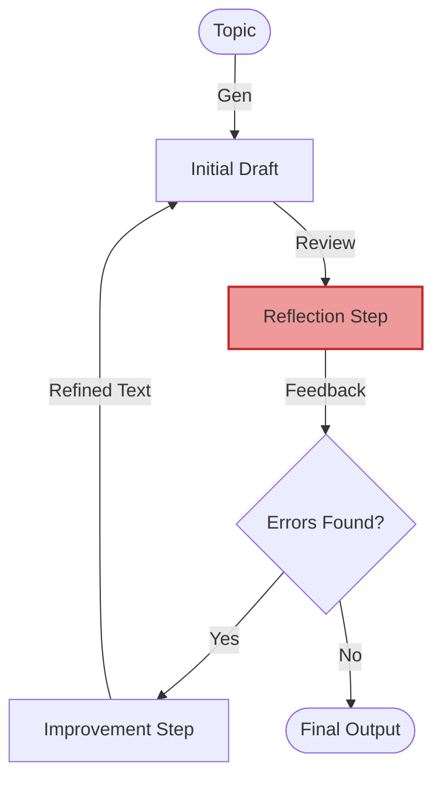

# Reflection Loop - Documentation

## 📄 File: `reflection.py`

### 🔍 Overview
This script checks strict **Reflection (Self-Correction)**. It implements a feedback loop where the model first generates content, then critiques strictly for factual errors, and finally rewrites the content based on that critique.

### 🌊 Workflow Diagram



### ⚙️ Key Logic
1.  **3-Step Functions**:
    *   `generate_content`: The creative step.
    *   `reflect_on_content`: The analytical step (The Critic).
    *   `improve_content`: The editing step.
2.  **Loop**: The `reflection_loop` function runs these steps for `n` iterations (`iterations=2` by default) to polish the output.

### 🚀 Usage
```bash
venv/bin/python "Reflection/reflection.py"
```
