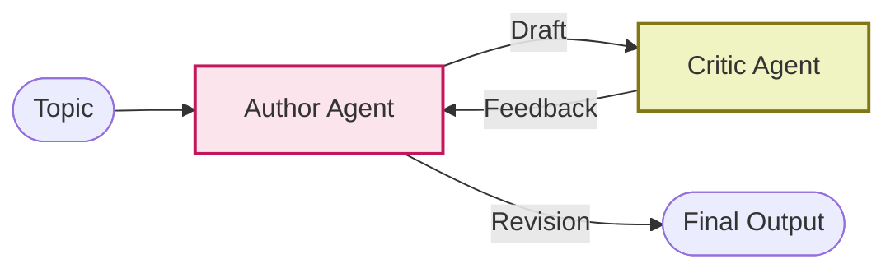

# Reflection ADK - Documentation

## 📄 File: `reflection_adk.py`

### 🔍 Overview
This script implements the **Reflection Pattern** using the Google ADK. It defines an `Author` agent and a `Critic` agent. The Author writes, the Critic reviews, and the Author rewrites based on the critique, orchestrated by the ADK's layout.

### 🌊 Workflow Diagram



### ⚙️ Key Logic
1.  **Role Separation**: Clearly defined "Creative" vs "Critical" roles.
2.  **Sequential Binding**: The ADK configuration links the output of the Author to the input of the Critic.

### 🚀 Usage
```bash
venv/bin/python "Reflection/reflection_adk.py"
```
