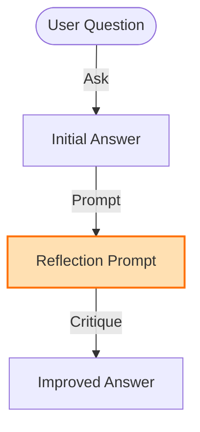

# Reflection LLM (Self-Consistency) - Documentation

## 📄 File: `reflection_llm.py`

### 🔍 Overview
This script demonstrates a **Self-Correction** loop using standard LLM API calls. It focuses on the logic of *improving* an answer by asking the model "Are you sure?" or "Can you improve this?".

### 🌊 Workflow Diagram



### ⚙️ Key Logic
1.  **Two-Step Prompting**:
    *   Step 1: "Answer the question."
    *   Step 2: "Review your previous answer `[Answer]` and correct any mistakes."

### 🚀 Usage
```bash
venv/bin/python "Reflection/reflection_llm.py"
```
