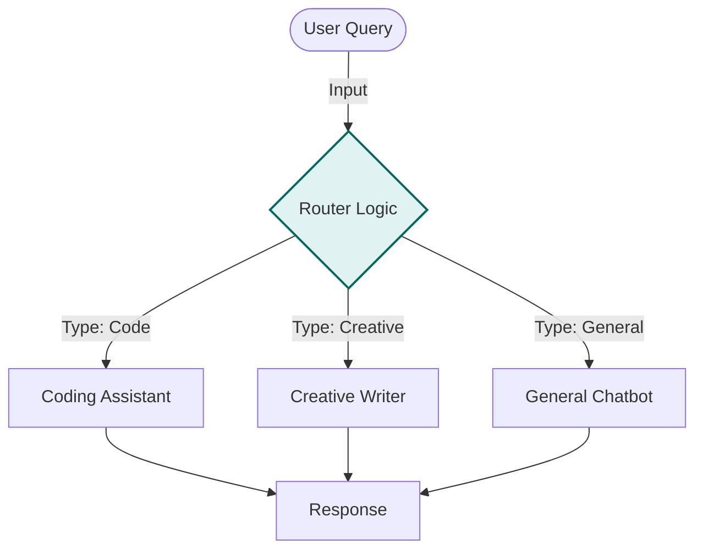

# Router Gemini - Documentation

## 📄 File: `router_gemini.py`

### 🔍 Overview
This script implements a **Routing Pattern** specifically optimized for the Gemini API. It categorizes user queries into distinct buckets (e.g., Coding, Writing, General) and selects a specific system instruction or "Expert Persona" to handle the response.

### 🌊 Workflow Diagram



### ⚙️ Key Logic
1.  **Classification Step**: The script first asks the model "What type of request is this?".
2.  **Switch Case**: Based on the classification, it swaps the system instruction or prompt context for the actual generation step.

### 🚀 Usage
```bash
venv/bin/python "Routing/router_gemini.py"
```
