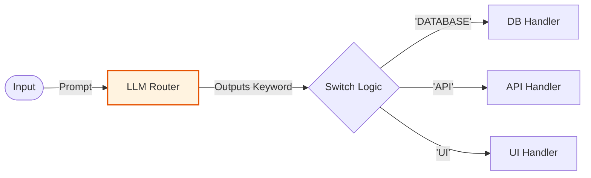

# Router LLM (Generic) - Documentation

## 📄 File: `router_llm.py`

### 🔍 Overview
This script demonstrates a **Generic LLM Router**. It uses a standard prompting approach to route requests without relying on specific framework features. It's a "Zero-Shot" routing example where the model is asked to output a keyword (e.g., "DATABASE", "API", "UI") which then triggers specific code paths.

### 🌊 Workflow Diagram



### ⚙️ Key Logic
1.  **Router Prompt**: "Classify the following request into one of these categories: [A, B, C]. Return ONLY the category name."
2.  **Control Flow**: Python `if/elif` blocks read the string output and execute the corresponding function.

### 🚀 Usage
```bash
venv/bin/python "Routing/router_llm.py"
```
