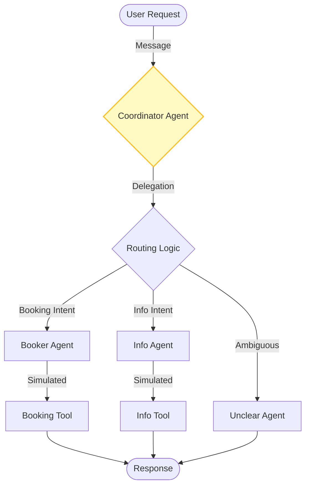

# Router Machine (ADK) - Documentation

## 📄 File: `router_machine.py`

### 🔍 Overview
This script demonstrates a robust **Routing Pattern** using the Google Agent Development Kit (ADK). It features a central **Coordinator Agent** that classifies incoming requests and delegates them to one of three specialized sub-agents: Booker, Info, or Unclear.

### 🌊 Workflow Diagram



### ⚙️ Key Logic
1.  **Coordinator Instructions**: The instruction set is critical. it explicitly defines the "boundary conditions" for when to punt a request to a sub-agent.
2.  **Sub-Agents**: Each sub-agent (Booker, Info) has a specific `FunctionTool` attached to it (`booking_handler`, `info_handler`) which simulates the actual API work.
3.  **ADK Runner**: Uses `InMemoryRunner` to manage the session state and message history.

### 🚀 Usage
```bash
venv/bin/python "Routing/router_machine.py"
```
