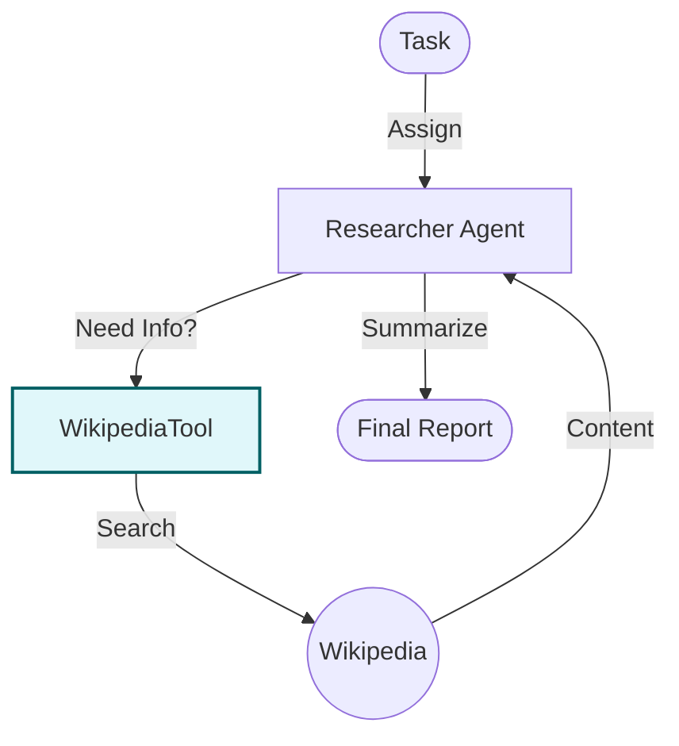

# Tool Use with CrewAI - Documentation

## 📄 File: `tool_crew_ai.py`

### 🔍 Overview
This script demonstrates how to integrate **Tools** (in this case, a Wikipedia search tool) into the **CrewAI** framework. It assigns specific tools to specific agents, allowing them to fetch external information during their task execution.

### 🌊 Workflow Diagram



### ⚙️ Key Logic
1.  **Tool Initialization**: `WikipediaQueryRun` is initialized as a tool wrapper.
2.  **Agent Config**: The `tools=[tool]` argument in the `Agent()` definition grants the agent access to that specific capability.
3.  **Task Execution**: When the agent realizes it doesn't know the answer (e.g., "AI trends 2024"), it autonomously decides to invoke the tool.

### 🚀 Usage
```bash
venv/bin/python "Tool Use/tool_crew_ai.py"
```
