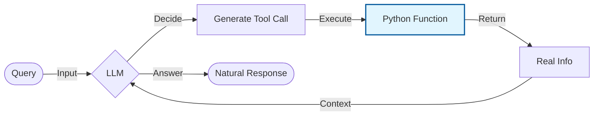

# Tool Use Example - Documentation

## 📄 File: `tool_use.py`

### 🔍 Overview
This script demonstrates the **ReACT / Tool Use** pattern. It defines a custom Python function (`search_information`), binds it to the Gemini model using LangChain, and allows the model to "call" this function when answering user queries.

### 🌊 Workflow Diagram



### ⚙️ Key Logic
1.  **@langchain_tool decorator**: Marks the `search_information` function as a tool the LLM can see.
2.  **Docstrings**: The docstring inside `search_information` is crucial—it tells the LLM *what* the tool does and *when* to use it.
3.  **Binding**: `llm.bind_tools(tools)` formally connects the code to the model schema.

### 🚀 Usage
```bash
venv/bin/python "Tool Use/tool_use.py"
```
